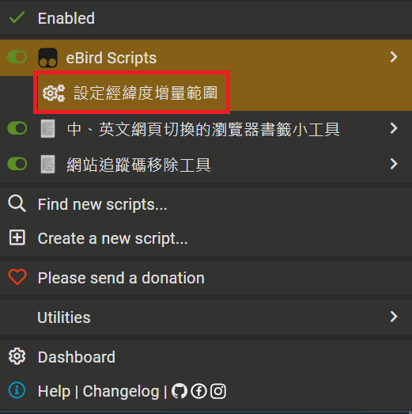

# eBird Scripts

## 緣起

使用新版 [eBird](https://ebird.org) 網站中，發現一些不甚好用的地方，因此製作此腳本以改善使用體驗。

## 功能

### eBird Scripts

eBird Scripts 是一個 [Tampermonkey](https://www.tampermonkey.net/) 使用者腳本，用於增強 [eBird](https://ebird.org) 網站的功能。

- 日期格式由「21 十月 2024」、「21日 10月 2024年」或「20 8月 2026」改為「2024/10/21」或「2026/8/20」格式顯示。
- [eBird 熱門鳥點](https://ebird.org/hotspots)
  - 開啟地圖時自動定位到目前位置，時間範圍設為今年全年度。
  - 點出各別地點的彈跳畫面內，新增「最近鳥種」及「最近紀錄」連結。


### eBird 文字輸入助手

Parse Taiwan birding notes, fill eBird forms, verify page values, and optionally submit after successful verification.

[eBird 文字輸入助手](https://github.com/ChrisTorng/eBirdScripts/raw/main/EBirdTextInputAssistant.user.js)可將慣用的臺灣賞鳥文字紀錄帶入 eBird 提交表單：

- 貼上後立即逐行顯示日期、地點、時間及鳥種的辨識結果，無法辨識的項目會以紅字標示。
- 可直接篩選及選取 eBird 地點，並在 Tampermonkey 本機設定地名簡稱、預設地點、努力量與人數。
- 支援多種日期簡寫、常用鳥種簡稱、鳥名與數字相連的寫法，以及「唱歌」、「聽到」與「一對」等細節。
- 核對面板採窄版、限制為約半個視窗高度；行動裝置預設收合，並可由右上角按鈕展開或收合。
- 填寫完成後及送出後，會分別重新讀取 eBird 頁面中的正式地點、日期時間、努力量、完整清單及鳥種欄位，逐項比對並標示結果。
- Completed checklists use structured date/time and effort fields, supporting English, Chinese, and dates rewritten by eBird Scripts. Species follow page order, including subspecies displayed under a parent species link.
- 「確認成功後自動儲存」預設開啟，但只有輸入無辨識失敗且提交頁全部讀回吻合時才會送出；任一項不符即禁止自動送出。

## 安裝

1. **安裝 [Tampermonkey](https://www.tampermonkey.net/)**<br>
   這是一個可用於管理使用者腳本的瀏覽器擴充套件。

2. **選擇要安裝的腳本：**
   - [安裝 eBird Scripts](https://github.com/ChrisTorng/eBirdScripts/raw/main/eBirdScripts.user.js)
   - [安裝 eBird 文字輸入助手](https://github.com/ChrisTorng/eBirdScripts/raw/main/EBirdTextInputAssistant.user.js)

3. 會自動開啟 Tampermonkey Install 畫面，請按 Install 鈕安裝。

4. 若先前已開啟了 [eBird](https://ebird.org/) 相關網頁，請重新整理網頁。

## 使用說明

### eBird Scripts

- 進入 [eBird 熱門鳥點](https://ebird.org/hotspots) 時，會要求取得位置之權限，只要選擇允許，就會預設定位到目前所在位置，時間範圍設定為今年全年。

- 在 [eBird 熱門鳥點](https://ebird.org/hotspots) 中點開任一熱點時，會看到新增的「最近鳥種」和「最近紀錄」的連結。

- 在各 eBird 網頁中的中文日期，會代換為 2021/10/21 的格式，比如在 [我的 eBird](https://ebird.org/myebird)
 中「最新紀錄清單」裡的日期

### eBird 文字輸入助手

1. 開啟 eBird「提交觀察紀錄」頁；助手會在 eBird 地點下拉清單前加入篩選欄位。
2. 貼上文字紀錄，右側會逐行顯示辨識結果。例如：

```text
2026/8/30
後港新公園
8：38 開始 28 分鐘
金背 1
珠頸 6 唱歌，1 聽到
麻雀 28
```

3. 已設定的地點簡稱會自動選到對應地點。若省略地點行，會使用勾選的預設地點；尚未設定預設地點時會以紅字要求選擇。新簡稱會用來篩選 eBird 地點，並自動展開「新增／管理地點」。
4. 在文字框下方確認本筆努力量。可選「附帶紀錄」，或輸入距離：0～0.03 公里為定點計數，超過 0.03 公里為行進計數。
5. 日期、地點與時間沒有紅字後，按「開始填寫紀錄」。若輸入仍有未知鳥種、重複鳥種、未知細節或必要資訊缺漏，「確認成功後自動儲存」會停用，其他已知項目仍可繼續填入供人工修正。
6. 到鳥種頁後，助手會隱藏未觀察鳥種；全部設定完成後，再從表單讀回正式地點、日期時間、努力量、耗時、距離、人數、完整清單，以及每種鳥的數量、繁殖代碼與附註。核對表依 eBird 頁面順序排列，吻合才顯示勾勾，不符則以紅字列出。
7. 若已勾選自動儲存，只有提交頁全部讀回吻合時才會送出；完成鳥單頁會再次讀取所有顯示內容。前後兩頁均符合時面板收合並以綠字顯示「全部檢查符合」，任一頁失敗則自動展開紅字結果。

#### 日期輸入

日期下拉清單預設為今天，並列出今天起向前七天；貼上的日期若更早，會自動加入並選取。文字日期可使用：

- 年/月/日、年-月-日或年.月.日。
- 月/日或月-日。
- `0`、`-1` 至 `-6`，分別代表今天及往前的天數。
- `一`、`二`、`三`、`四`、`五`、`六`、`日`，代表今天或最近一次的該星期日。

#### 地點篩選

篩選欄位支援中英文。每個輸入字元會依序篩選所有地點名稱及 ID；若某個字元會使結果變成零筆，該字元會被忽略，因此清單絕不會完全消失。

## 設定

### eBird Scripts

- 開啟 Tampermonkey 外掛畫面，或由 [eBird](https://ebird.org/) 網站中 (除地圖外) 任意處按右鍵，選擇 Tampermonkey - eBird Scripts 之下，可看到設定功能



- 目前支援設定「設定經緯度增量範圍」，也就是開啟 [eBird 熱門鳥點](https://ebird.org/hotspots) 時預設地圖放大的範圍，預設值 0.05。數字越小，預設顯示地圖越放大。

### eBird 文字輸入助手

- 地點設定儲存在 Tampermonkey 本機空間，可自由新增、修改或刪除，不會上傳。
- 每個地名簡稱可設定 eBird 地點 ID、完整名稱、預設努力量與人數，並可勾選其中一個作為未填地點時的預設地點。
- 未填努力量時預設為「附帶紀錄」；設定距離後，0～0.03 公里使用定點計數，超過 0.03 公里使用行進計數。
- 若文字中的日期、時間、地點或鳥種無法確定，右側會以紅字顯示；助手不會猜測後送出。

## 相關作品

請參考我製作的 [eBird 鳥訊快報整理](https://christorng.github.io/InfoProcess/eBird/)，幫助快速瀏覽 [eBird 鳥訊快報](https://ebird.org/alerts)郵件內容。

## 問題與建議

如果遇到任何問題或功能建議，請至 [GitHub 頁面](https://github.com/ChrisTorng/eBirdScripts/) 提交 [issue](https://github.com/ChrisTorng/eBirdScripts/issues)。
